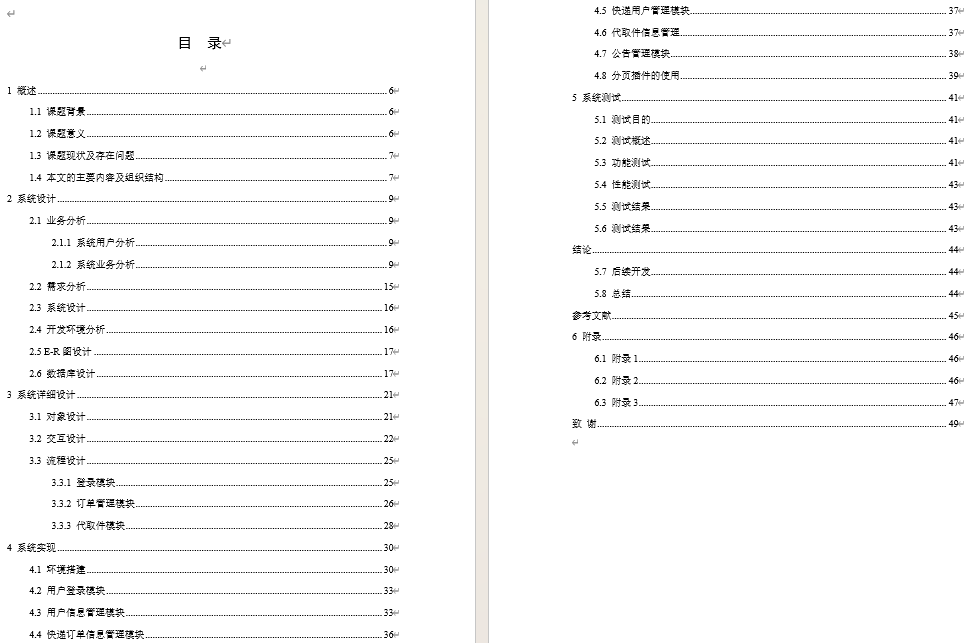
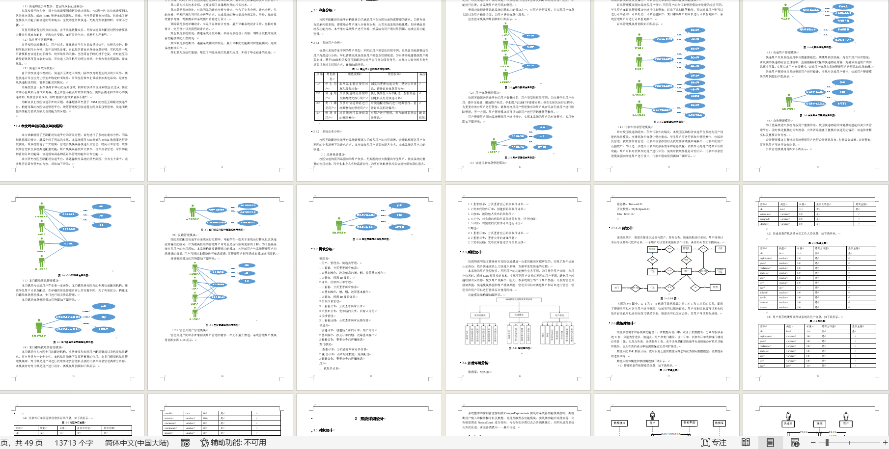
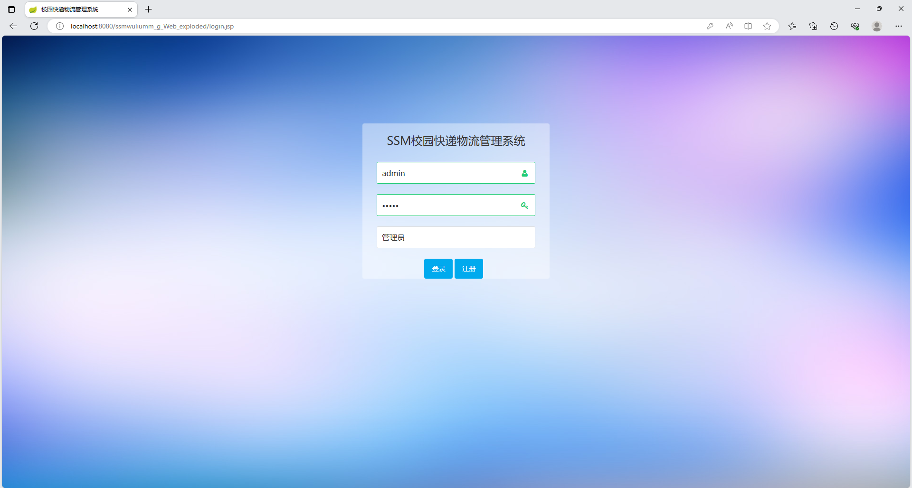
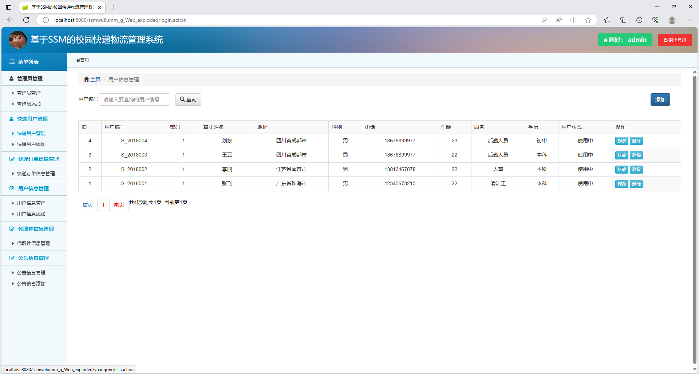
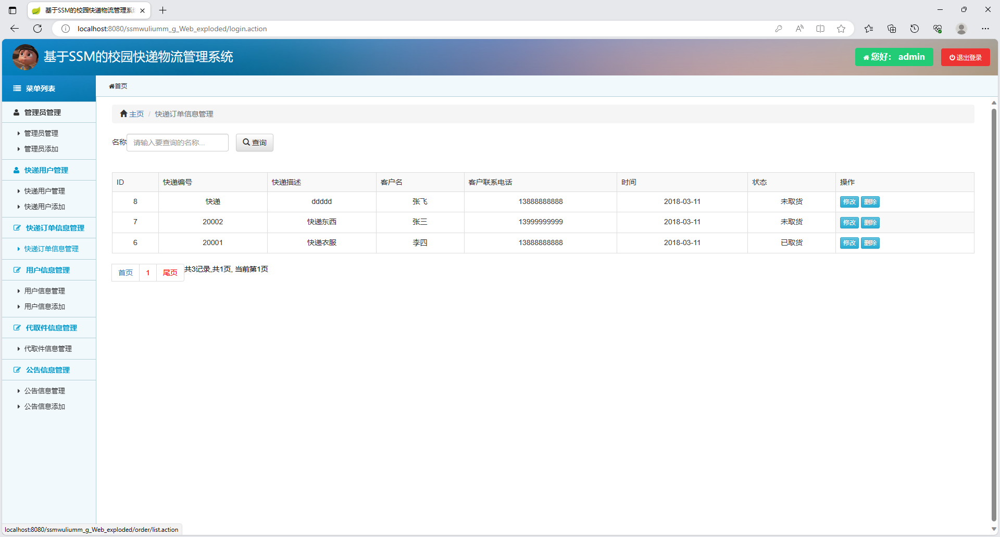
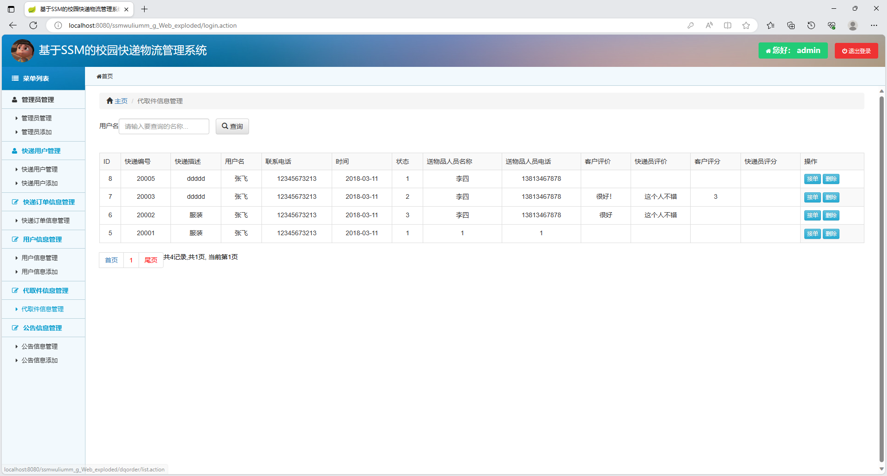

# 基于SSM的物流管理系统

### 可用作校园快递物流管理系统、校园物流管理系统、快递管理系统、物流管理系统

### 9.9￥ 获取完整源码+sql，附赠13000字论文参考，需要加Q：3808981644 备用Q：3577148218
### 有问题，或者需要协助调试运行项目的也可联系
### 更多项目： https://github.com/34426?tab=repositories

## 一、项目介绍

开发语言：java

运行环境:idea或eclipse 数据库:mysql

技术栈：spring 、spring MVC 、mybatis、jsp

三个角色:管理员、快递员、用户

本系统实现了三大模块：

管理员模块:具备快递人员管理、物流订单管理、取件发件管理以及系统其他配置功能；

用户模块:具备发布代取件、送件信息管理、评价功能和查询订单功能等；

快递模块:具备物流订单管理功能和公告功能

## 二、13000字论文参考

## 三、部分功能界面展示

### 四、 9.9￥ 获取完整源码+sql，附赠13000字论文参考，需要加Q：3808981644 备用Q：3577148218
### 有问题，或者需要协助调试运行项目的也可联系

